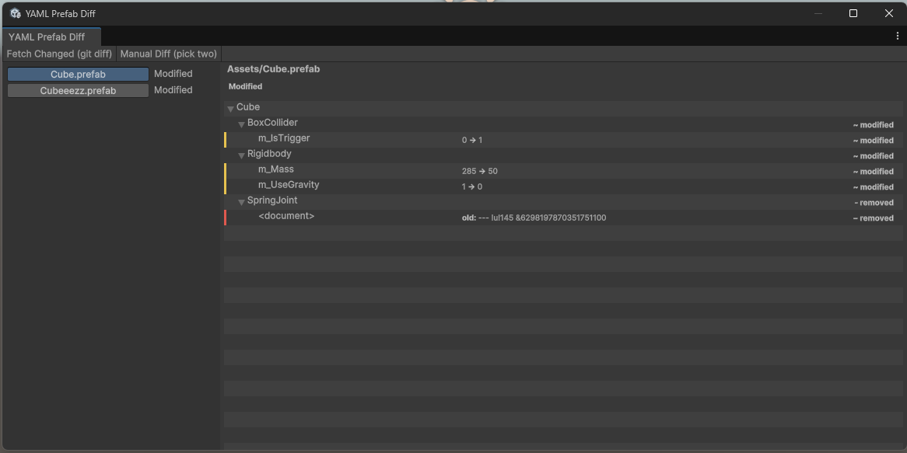
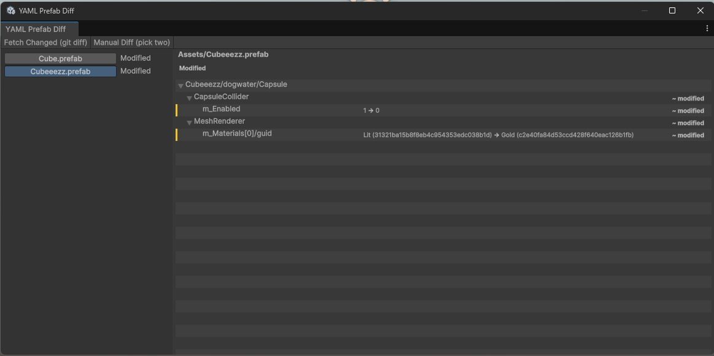

# Visual YAML - Unity YAML Diff Tool

A Unity Editor extension that visualizes differences between YAML-serialized Unity assets — prefabs, scenes, materials, ScriptableObjects, and more. Built for teams using Git, where raw YAML diffs of `.prefab` and `.unity` files are unreadable.

## Features

- **Hierarchical YAML Diffing:**
  Compare YAML files and see changes organized by GameObject > Component > Field, not raw text lines.

- **Full Asset Support:**
  Prefabs, scenes (`.unity`), materials (`.mat`), ScriptableObjects (`.asset`), and more.

- **RectTransform & UI Support:**
  Correctly handles UI hierarchies (Canvas, Panels, Buttons) with RectTransform (class 224).

- **Nested Prefab Awareness:**
  Handles `stripped` documents and PrefabInstance references from nested prefabs.

- **Git Integration:**
  - Fetch changes from last commit, working tree, or staged files
  - Compare any asset to a previous commit
  - Manual file comparison as fallback

- **MonoBehaviour Script Resolution:**
  Resolves script GUIDs to actual class names (e.g., shows "PlayerController" instead of "MonoBehaviour").

- **GUID Prettification:**
  Replaces 32-character hex GUIDs with human-readable asset names.

- **Search & Filter:**
  Type to filter changes by GameObject name, component type, field path, or value.

- **Context Menu:**
  Right-click any change to copy field paths or values.

## Installation

1. **Via Git URL (recommended):**
   In Unity: Window > Package Manager > + > "Add package from git URL..."
   Enter the repository URL.

2. **Via Local Disk:**
   Clone the repo, then in Unity: Window > Package Manager > + > "Add package from disk..."
   Select the `package.json` file.

The package includes `YamlDotNet.dll` in the Plugins folder. Ensure your project's API Compatibility Level is set to **.NET Standard 2.1** (Project Settings > Player > Api Compatibility Level).

## Usage

1. **Open the Tool:**
   In Unity, go to **Tools > Visual YAML > Diff Tool**.

2. **Select Comparison Mode:**
   Use the "Source" dropdown to choose: Last Commit, Working Tree, or Staged.

3. **Fetch Changes:**
   Click **Fetch Changes** to detect modified YAML assets from Git.

4. **View Diffs:**
   Select an asset on the left panel to see its hierarchical diff on the right.

5. **Manual Comparison:**
   Click **Manual Diff** to compare any two YAML files directly.

6. **Compare to Commit:**
   Select an asset, then click **Compare to Commit** to pick a specific commit from history.

## Requirements

- **Unity:** 2022.3 LTS or later
- **Git:** Required for Git integration. Your Unity project must be inside a Git repository.
- **.NET Standard 2.1:** API Compatibility Level must be .NET Standard 2.1 (default in Unity 2022.3).

## License

MIT License. See [LICENSE.md](LICENSE.md) for details.

## Contributing

Contributions, issues, and feature requests are welcome! Feel free to open an issue or submit a pull request.
